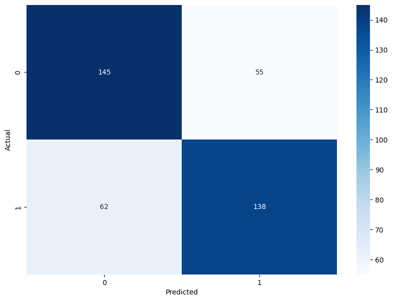
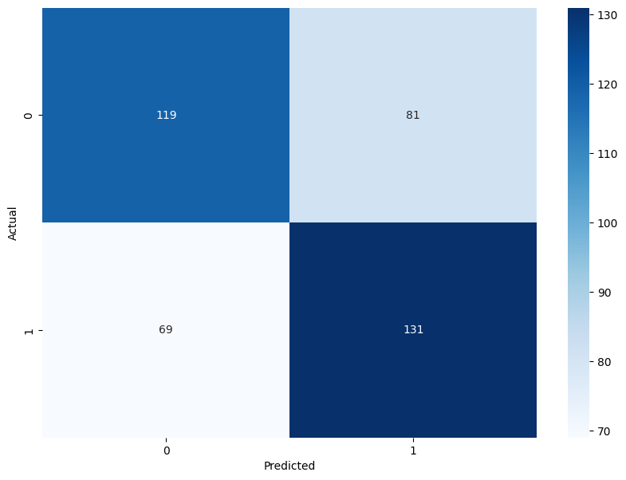
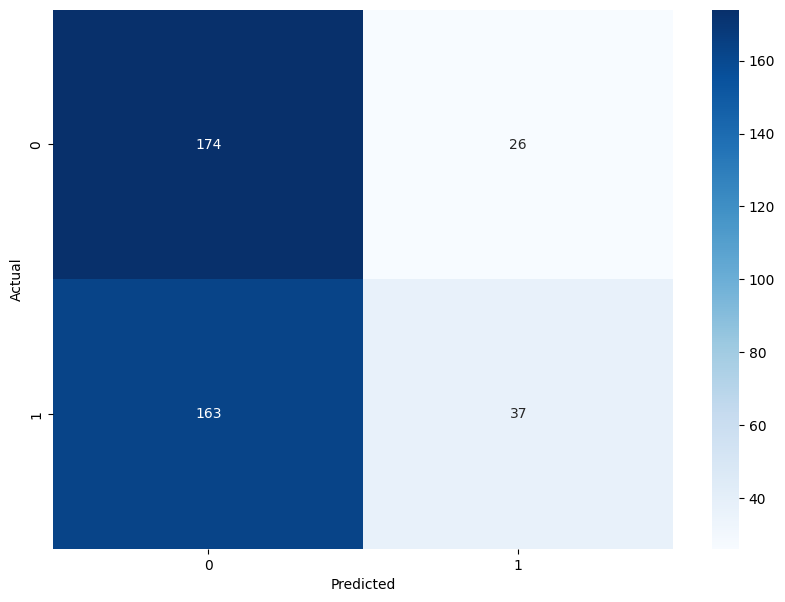
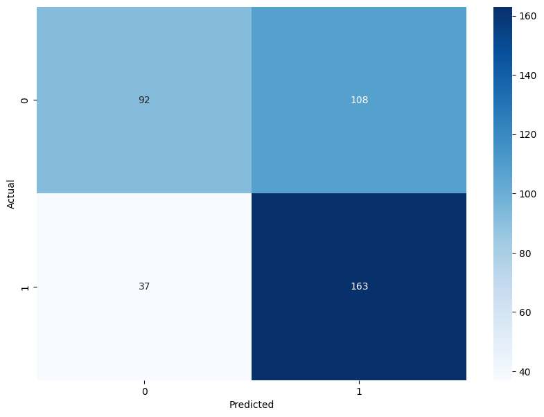
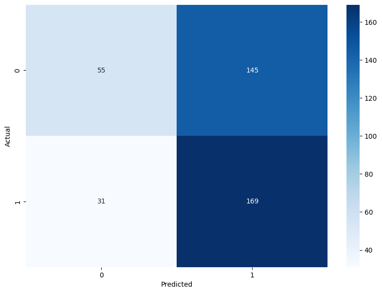

# SVM Dogs vs. Cats Classification 

## Description

This project aims to classify images of cats and dogs using various Support Vector Machine (SVM) models. The main challenge addressed was the extensive training time due to the large dataset size, which necessitated using subsets of the data for efficient model training.

## Dataset

The dataset contains images of cats and dogs and can be found on [Kaggle](https://www.kaggle.com/c/dogs-vs-cats/data). Due to the large size, subsets of the data were used for training:

- **Initial Subset**: 8000 images (4000 cats and 4000 dogs)
- **Reduced Subset**: 2000 images (1000 cats and 1000 dogs)

## Models

Several SVM models were trained with different kernels and configurations:

1. **SVM with Linear Kernel**
   - **Dataset**: 8000 images
   - **Training Time**: Around 64 minutes
   - **Accuracy**: 70.75% 
   - **Classification Report**:
     ```
                   precision    recall  f1-score   support

           0       0.70      0.72      0.71       200
           1       0.72      0.69      0.70       200
     accuracy                          0.71       400
     macro avg     0.71      0.71      0.71       400
     weighted avg  0.71      0.71      0.71       400
     ```
   - **Confusion Matrix**:
     
     

     

2. **SVM with RBF Kernel (gamma='scale')**
   - **Dataset**: 2000 images
   - **Accuracy**: 62.5% 
   - **Classification Report**:
     ```
                         precision    recall  f1-score   support
      
                 0       0.63      0.59      0.61       200
                 1       0.62      0.66      0.64       200
      
          accuracy                           0.62       400
         macro avg       0.63      0.62      0.62       400
      weighted avg       0.63      0.62      0.62       400

     ```
   - **Confusion Matrix**:

     

3. **SVM with GridSearchCV**
   - **Dataset**: 2000 images
   - **Best Parameters**: {'C': 1, 'gamma': 0.001, 'kernel': 'rbf'} (example, replace with actual)
   - **Accuracy**: 0.53% 
   - **Classification Report**:
     ```
                         precision    recall  f1-score   support
      
                 0       0.52      0.87      0.65       200
                 1       0.59      0.18      0.28       200
      
          accuracy                           0.53       400
         macro avg       0.55      0.53      0.46       400
      weighted avg       0.55      0.53      0.46       400

     ```
   - **Confusion Matrix**:

     

4. **SVM with Polynomial Kernel (degree=2)**
   - **Dataset**: 2000 images
   - **Accuracy**: 0.63% 
   - **Classification Report**:
     ```
                         precision    recall  f1-score   support
      
                 0       0.71      0.46      0.56       200
                 1       0.60      0.81      0.69       200
      
          accuracy                           0.64       400
         macro avg       0.66      0.64      0.63       400
      weighted avg       0.66      0.64      0.63       400

     ```
   - **Confusion Matrix**:

    

5. **SVM with Polynomial Kernel (degree=3)**
   - **Dataset**: 2000 images
   - **Accuracy**: 0.53%
   - **Classification Report**:
     ```
                         precision    recall  f1-score   support
      
                 0       0.64      0.28      0.38       200
                 1       0.54      0.84      0.66       200
      
          accuracy                           0.56       400
         macro avg       0.59      0.56      0.52       400
      weighted avg       0.59      0.56      0.52       400

     ```
   - **Confusion Matrix**:

    
   

## Installation

To set up the project on your local machine:

1. Clone the repository:
    ```bash
    git clone https://github.com/jayesh-parmarr/SVM-Dogs-vs-Cats-Classification.git
    cd SVM-Dogs-vs-Cats-Classification
    ```

2. Install the required packages:
    ```bash
    pip install -r requirements.txt
    ```

3. Download the dataset from [Kaggle](https://www.kaggle.com/c/dogs-vs-cats/data) and place it in the `dataset` directory.

## Usage

Run the main notebook:
```bash
jupyter notebook svm.ipynb
```

## Deployment (Future Work)
  The model can be deployed using Streamlit, allowing users to upload an image and get predictions. The model and scaler files can be stored on Google Drive and downloaded    during runtime to handle large file sizes.

## Contributors
  Jayesh Parmar - Initial work - [jayesh-parmarr](https://github.com/jayesh-parmarr/)
## License
 This project is licensed under the MIT [License](LICENSE) - see the LICENSE file for details.

